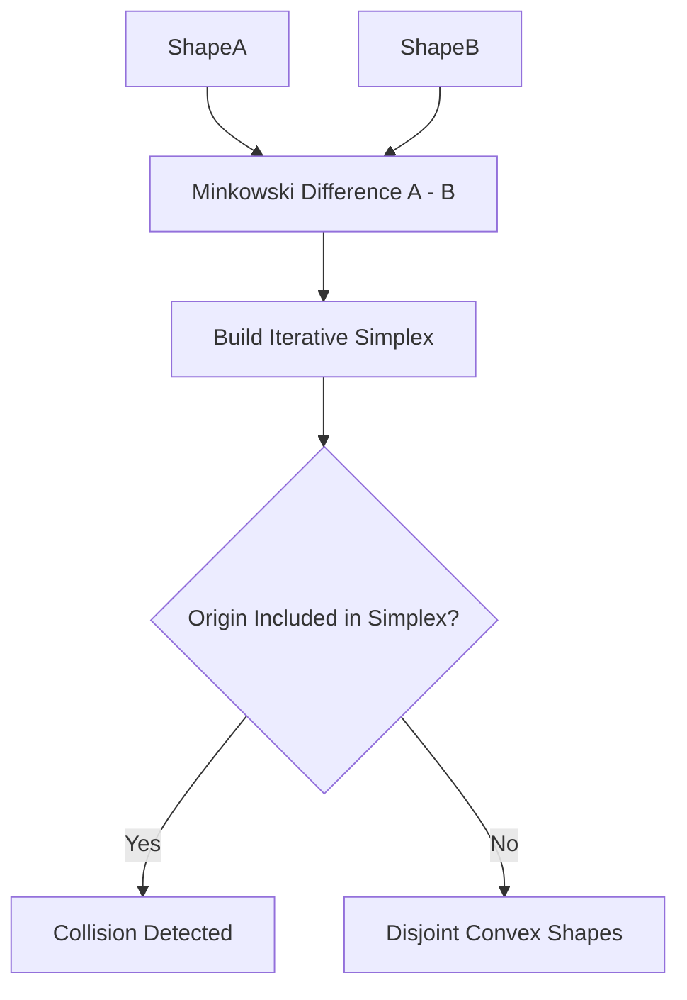

# GJK Convex Collision Detection Skill

Robust, zero-dependency Python implementation of the **Gilbert-Johnson-Keerthi (GJK)** algorithm for convex polygon collision detection.

## Features
- **Minkowski Difference Simplex**: Reductively searches for origin inclusion within Minkowski difference polytope.
- **Support Mapping Generalization**: Evaluates arbitrary convex hulls without explicit vertex mesh boolean intersections.
- **Zero External Dependencies**: Pure Python standard library.
- **Native MCP Protocol**: JSON-RPC 2.0 stdio server compatible with Claude Desktop, Cursor, and Windsurf.

## Architecture

